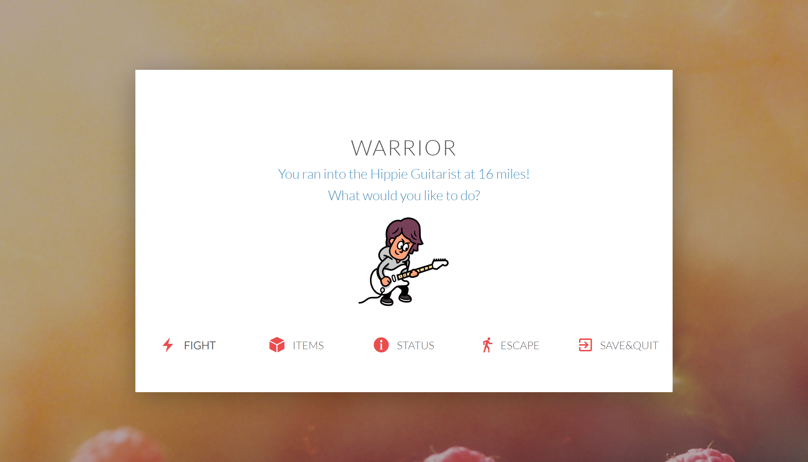

# ASCII
A fun game for you to enjoy ^^      

## Setup
- Clone this repository
- Run index.html

## Features 
- Six different enemy classes with different attacking styles
- Two characters (Warrior & Sorcerer) for the user to choose to play with
- Can view character status and current item lists

## Screenshots
                
                  
             
                     
              

## More to come
- Final Boss
- Save/Resume game
- User account, Log in/Sign in, etc
                   
## Credits
Special thanks to [Wooju Yim](https://github.com/woojuyim/ASCII-Game)
